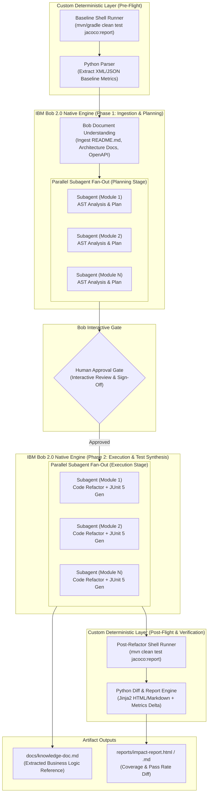

# System Architecture & Workflow — SpringPhoenix

## 1. Architectural Overview

SpringPhoenix operates as a hybrid, multi-stage modernization pipeline orchestrating **IBM Bob 2.0 Native Capabilities** (Agent Mode, Parallel Subagents, Document Understanding, and Interactive CLI Gates) alongside a lightweight **Custom Deterministic Layer** (Python reporting engine, `.bob/SKILL.md` rulesets, and native shell/build runners).



---

## 2. Bob-Native vs. Custom Layer Separation

| Stage / Component | Layer | Execution Mechanism | Responsibility |
|---|---|---|---|
| **1. Baseline Capture** | **Custom Layer** | Local Shell Scripts + Python CLI | Deterministically executes `mvn test` or `gradle test`, parses Surefire and JaCoCo XML reports, captures pre-upgrade pass rates and coverage baselines. |
| **2. Document Understanding** | **Bob-Native** | IBM Bob Doc Understanding Engine | Ingests `README.md`, specs, domain wikis, and configuration files into high-dimensional context embeddings for agent comprehension. |
| **3. Parallel Subagents (Plan)** | **Bob-Native** + **Custom SKILL.md** | Bob Subagent Swarm (`.bob/SKILL.md`) | Dispatches one isolated subagent per module/package. Subagents read ASTs, identify Spring Boot 3 migration paths, and extract undocumented business logic. |
| **4. Human Approval Gate** | **Bob-Native** | Bob CLI / Agent Prompt Checkpoint | Suspends pipeline execution and presents a unified refactoring plan, risk matrix, and file diff preview for human developer authorization. |
| **5. Parallel Subagents (Exec)** | **Bob-Native** + **Custom SKILL.md** | Bob Subagent Swarm (`.bob/SKILL.md`) | Concurrently applies Java/Spring migrations (`jakarta.*`, Security configs, POM dependencies) and generates targeted JUnit 5 + Mockito tests. |
| **6. Deterministic Re-Test** | **Custom Layer** | Local Shell Scripts (`mvn/gradle`) | Re-runs clean build and JaCoCo coverage collection on the modernized codebase without AI hallucination risk. |
| **7. Summary & Knowledge Reporting** | **Custom Layer** + **Bob-Native** | Python Engine (Jinja2) + Bob Summarizer | Calculates exact delta between baseline and modernized runs, compiling the final visual before/after Impact Report and `knowledge-doc.md`. |

---

## 3. End-to-End Pipeline Stages

### Stage 1: Deterministic Baseline Capture
- **Mechanism:** Shell execution through Python helper subprocess wrapper.
- **Input:** Legacy project root directory.
- **Action:** Runs native build (`mvn clean test jacoco:report` or `gradle test jacocoTestReport`).
- **Output:** Structured `artifacts/baseline.json` containing:
  - Compilation status (Success/Failure)
  - Test suites total, passed, failed, skipped
  - JaCoCo line coverage %, branch coverage %, and method coverage % per package.

### Stage 2: Document Understanding
- **Mechanism:** IBM Bob 2.0 Document Ingestion engine.
- **Input:** Project documentation (`README.md`, `/docs`, `swagger.json`, `application.yml`).
- **Action:** Semantic parsing of business domain terminology, external integration dependencies, and architectural patterns.
- **Output:** Shared contextual context graph accessible across all subagents.

### Stage 3: Parallel Subagent Module Planning & Logic Extraction
- **Mechanism:** IBM Bob 2.0 Parallel Subagent dispatch guided by `.bob/SKILL.md`.
- **Worker Allocation:** 1 Subagent per module or bounded package context.
- **Subagent Actions:**
  1. **Dependency Analysis:** Maps legacy dependencies to Spring Boot 3 / Java 17+ equivalents.
  2. **API Deprecation Mapping:** Identifies deprecated classes (`WebSecurityConfigurerAdapter`, `RestTemplate` vs `WebClient`/`RestClient`, `javax.persistence` vs `jakarta.persistence`).
  3. **Undocumented Logic Detection:** Flags un-annotated domain calculations, implicit fallback behaviors, magic constants, and complex branching.
- **Output:** Aggregated `refactor-plan.json` and preliminary knowledge fragments.

### Stage 4: Human Approval Gate
- **Mechanism:** Bob Interactive Checkpoint.
- **Action:** Displays structured migration summary to the developer:
  - List of affected files per module.
  - Flagged critical business logic requiring special attention.
  - Proposed dependency changes.
- **Options:** `[A]pprove & Apply`, `[M]odify Plan`, or `[R]eject & Abort`.

### Stage 5: Parallel Subagent Execution & Test Generation
- **Mechanism:** IBM Bob 2.0 Parallel Execution Subagents.
- **Subagent Actions:**
  1. **Code Refactoring:** Modifies source files, updates configuration annotations, updates `pom.xml` / `build.gradle`.
  2. **Unit Test Synthesis:** Generates JUnit 5, AssertJ, and Mockito tests for uncovered methods and refactored business components.
  3. **Knowledge Compilation:** Writes detailed documentation for flagged logic into `docs/knowledge-doc.md`.
- **Output:** Modernized source files, newly created test files, and business knowledge reference.

### Stage 6: Deterministic Re-Test
- **Mechanism:** Local Shell Runner.
- **Action:** Re-executes `mvn clean test jacoco:report` against the modified codebase.
- **Output:** `artifacts/post-refactor.json`.

### Stage 7: AI-Generated Summary & Impact Reporting
- **Mechanism:** Python Helper Engine (`src/reporter.py` with Jinja2) + Bob Summarizer.
- **Action:** Compares `baseline.json` against `post-refactor.json`. Computes metric differentials.
- **Output:**
  - `reports/impact-report.html` & `reports/impact-report.md`
  - Visual metrics: coverage delta, new tests passing, time saved, and modernized component inventory.

---

## 4. Data Flow & Artifact Lifecycle

```
[Legacy Source Code]
        │
        ▼ (Stage 1: Shell Runner)
  [artifacts/baseline.json] ──┐
                              │
  [Docs / Specs / Readme]     │
        │                     │
        ▼ (Stage 2: Bob Ingestion)
  [Semantic Context Graph]    │
        │                     │
        ▼ (Stage 3: Subagents Fan-Out)
  [artifacts/refactor-plan.json]
        │
        ▼ (Stage 4: Human Gate)
  [User Approval Decision]
        │
        ▼ (Stage 5: Parallel Subagents Execution)
  [Modernized Source + JUnit 5 Tests] ──> [docs/knowledge-doc.md]
        │
        ▼ (Stage 6: Shell Re-Test)
  [artifacts/post-refactor.json] ──┐
                                   │
                                   ▼ (Stage 7: Report Engine)
                      [reports/impact-report.html / .md]
```

---

## 5. SKILL.md and Custom Rules Integration

The `.bob/SKILL.md` file defines the operational contracts and guidelines for IBM Bob agents:
1. **Migration Rules:** Specific rules for Spring Boot 2.x -> 3.x, Hibernate 5 -> 6, and Jakarta EE namespaces.
2. **Testing Standards:** Mandates AAA (Arrange-Act-Assert) pattern, isolated mock configurations, and high branch coverage.
3. **Logic Flagging Criteria:** Explicit heuristics for identifying implicit business logic (e.g., hardcoded discount rules, conditional fallbacks, date-time hacks).
