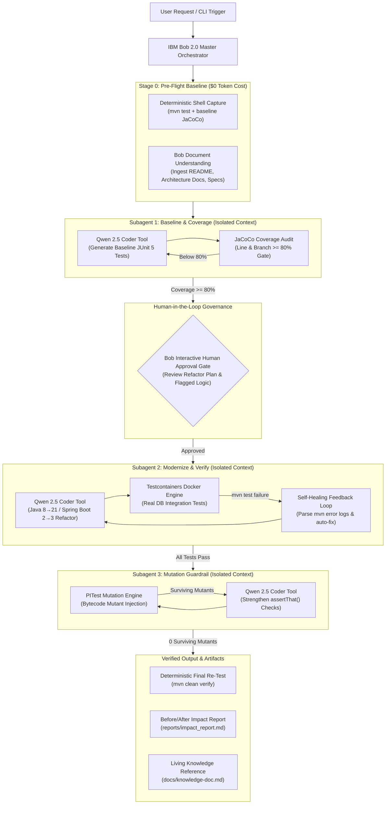
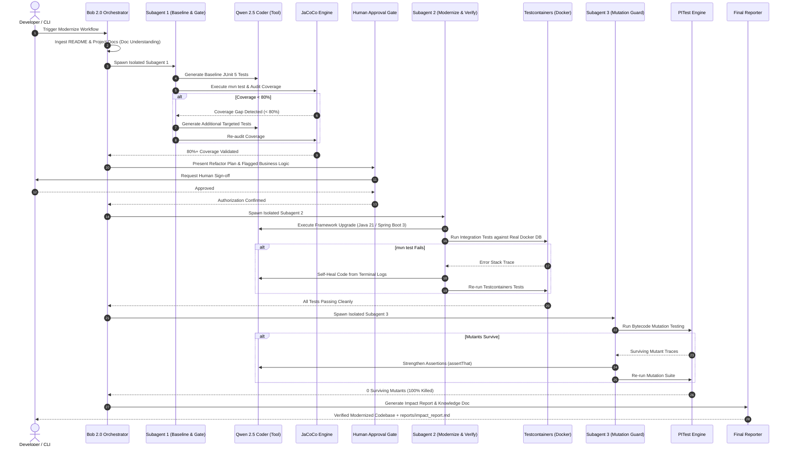

# System Architecture & Workflow — SpringPhoenix

## 1. Architectural Overview

SpringPhoenix operates as an autonomous, 3-stage modernization architecture orchestrated by **IBM Bob 2.0**. Bob functions as the master workflow controller, managing state transitions, executing document understanding, enforcing human-in-the-loop approval, and invoking **Qwen 2.5 Coder** as a controlled execution tool within isolated subagent environments.



---

## 2. Why the 3-Subagent Split Exists

Running all 5 modernization stages (baseline generation, coverage auditing, syntax modernization, Docker integration testing, and mutation testing) within a single AI context causes catastrophic **context bloat**. Thousands of lines of terminal compilation errors, Surefire XML outputs, JaCoCo coverage matrices, and PITest bytecode mutant logs saturate token windows, causing hallucinations and degraded code quality.

SpringPhoenix solves this by isolating each phase into a dedicated IBM Bob 2.0 subagent operating in a clean, sandboxed workspace with focused tool access.

```
┌─────────────────────────────────────────────────────────────────────────┐
│                    IBM Bob 2.0 Master Orchestrator                      │
└──────┬───────────────────────────┬───────────────────────────┬──────────┘
       │                           │                           │
       ▼                           ▼                           ▼
┌──────────────────┐       ┌──────────────────┐       ┌──────────────────┐
│   Subagent 1     │       │   Subagent 2     │       │   Subagent 3     │
│ Baseline & Gate  │ ────► │ Modernize & Self │ ────► │ Mutation Guard   │
│ (Qwen + JaCoCo)  │       │(Qwen+Containers) │       │ (PITest + Qwen)  │
│ 80%+ Coverage    │       │ Clean mvn build  │       │ 0 Surviving Mut. │
└──────────────────┘       └──────────────────┘       └──────────────────┘
```

### Subagent 1 — Baseline & Coverage
- **Purpose:** Lock in existing legacy service behavior with tests prior to code changes.
- **Mechanism:** Qwen 2.5 Coder generates comprehensive JUnit 5 and Mockito tests for legacy endpoints and domain services.
- **Audit Gate:** JaCoCo measures line and branch coverage against a strict **80% threshold**. If coverage falls below 80%, the subagent automatically loops back to Qwen with uncovered method signatures until the gate is cleared.

### Subagent 2 — Modernize & Verify
- **Purpose:** Modernize dependencies and source code while validating against real persistence stores.
- **Mechanism:** Qwen 2.5 Coder upgrades the codebase (e.g., Java 8/11 $\rightarrow$ 21, Spring Boot 2 $\rightarrow$ 3, `javax.*` $\rightarrow$ `jakarta.*`, `SecurityFilterChain` beans).
- **Testcontainers Integration:** Spins up real Docker database instances (PostgreSQL, MySQL, MariaDB, Oracle) to execute integration tests against actual SQL dialects and constraints instead of fragile mocks.
- **Self-Healing Loop:** If `mvn test` fails, Qwen reads the terminal error stack trace directly, pinpoints the compilation/runtime defect, adjusts the code, and re-executes tests until all baseline tests pass.

### Subagent 3 — Mutation Guardrail
- **Purpose:** Guarantee test suite resilience and eliminate brittle, false-positive tests.
- **Mechanism:** PITest injects artificial bytecode mutations (e.g., conditional boundary inversions, return value mutations, void method removals).
- **Assertion Hardening:** If any mutants survive (indicating the test suite failed to catch an injected regression), Qwen inspects the surviving mutant traces and strengthens `assertThat()` assertions and boundary validations until **100% of mutants are killed (0 surviving mutants)**.

---

## 3. Bob-Native vs. Custom Layer Architecture

| Layer | Component | Execution Mechanism | Role |
|---|---|---|---|
| **Bob-Native** | **Master Workflow Orchestrator** | Bob 2.0 Engine | Coordinates stage transitions, passes scoped context packets, and manages subagent lifecycles. |
| **Bob-Native** | **Document Understanding** | Bob Doc Ingestion | Parses `README.md`, specs, and domain wikis into contextual embeddings for business-logic discovery. |
| **Bob-Native** | **Human Approval Gate** | Bob Interactive CLI | Suspends execution before refactoring; presents diff previews and risk matrices for explicit user sign-off. |
| **Tool Execution** | **Qwen 2.5 Coder** | Tool Invocation via Bob Subagents | Operates strictly as a tool invoked by Bob subagents for test generation, refactoring, self-healing, and assertion hardening. |
| **Custom Layer** | **JaCoCo Coverage Auditor** | Local Maven Plugin + Python Parser | Deterministically checks line/branch coverage against 80% gate without LLM subjectivity. |
| **Custom Layer** | **Testcontainers Engine** | Docker daemon + JUnit Testcontainers | Spawns real containerized DB instances for regression-free data-layer validation. |
| **Custom Layer** | **PITest Mutation Engine** | Maven PITest Plugin | Injects bytecode mutants to audit test assertion strength. |
| **Custom Layer** | **Metrics & Report Generator** | Python Helper (`reports/reporter.py`) | Compares baseline vs. modernized artifacts and renders `reports/impact_report.md` / `.html`. |

---

## 4. End-to-End Orchestration Flow



---

## 5. Data Flow & Controlled Tool Execution

In SpringPhoenix, **Bob 2.0 is the orchestrator and controller**, while **Qwen 2.5 Coder operates strictly as a tool invoked inside isolated subagent boundaries**. Qwen never runs independently outside Bob's supervision.

```
[Legacy Source Code]
        │
        ▼ (Stage 0: Deterministic Baseline)
  [reports/baseline.json]
        │
        ▼ (Stage 1: Bob Subagent 1 Workspace)
  ┌───────────────────────────────────────────────┐
  │  Bob Subagent 1 ──calls──> Qwen (Test Gen)    │
  │        ▲                      │               │
  │        └──JaCoCo Audit (<80%)─┘               │
  └───────────────────────────────────────────────┘
        │ (Coverage >= 80%)
        ▼
  [Human Approval Checkpoint in Bob CLI]
        │ (Approved)
        ▼ (Stage 2: Bob Subagent 2 Workspace)
  ┌───────────────────────────────────────────────┐
  │  Bob Subagent 2 ──calls──> Qwen (Modernize)   │
  │        ▲                      │               │
  │        │                 Testcontainers       │
  │        └──Self-Heal Log Failure ──┘           │
  └───────────────────────────────────────────────┘
        │ (Clean build & passing tests)
        ▼ (Stage 3: Bob Subagent 3 Workspace)
  ┌───────────────────────────────────────────────┐
  │  Bob Subagent 3 ──calls──> PITest Mutation    │
  │        ▲                      │               │
  │        └──Qwen Strengthens Assertions ◄───────┘
  └───────────────────────────────────────────────┘
        │ (0 Surviving Mutants)
        ▼
  [Final Re-Test & Report Generation Engine]
        ├──> [reports/impact_report.md & .html]
        └──> [docs/knowledge-doc.md]
```

---

## 6. Configuration & Rule Contracts (`.bob/SKILL.md`)

Subagents adhere to deterministic rules specified in `.bob/SKILL.md`:
1. **Coverage Thresholds:** Minimum 80% line and branch coverage required before Subagent 1 can emit state to the human approval gate.
2. **Modernization Standards:** Strict migration rules for Spring Boot 2.x $\rightarrow$ 3.x, Hibernate 5 $\rightarrow$ 6, and Jakarta namespace migrations.
3. **Database Integration:** Directs Subagent 2 to utilize Testcontainers annotations (`@Testcontainers`, `@Container`) rather than in-memory H2 fallbacks when real SQL semantics are present.
4. **Mutation Standards:** Requires all mutation survivors in business-critical packages to be addressed with concrete AssertJ value assertions.
