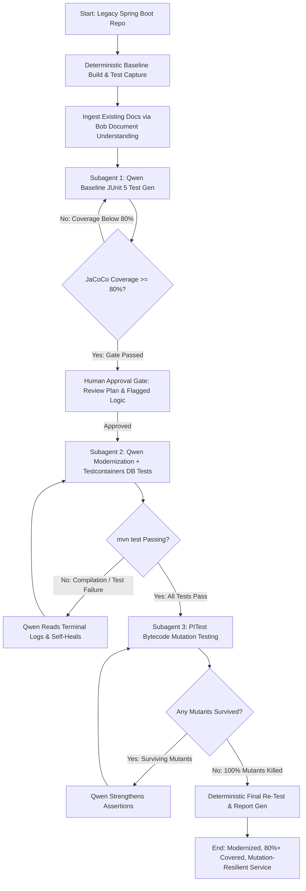

# Product Requirements Document (PRD) — SpringPhoenix

## 1. Overview
**SpringPhoenix** is an autonomous, subagent-driven modernization pipeline built on **IBM Bob 2.0** for enterprise engineering teams. It safely accelerates legacy Spring Boot migrations (e.g., Java 8/11 and Spring Boot 1.5.x/2.x to Java 17/21 and Spring Boot 3.x) by combining deterministic build/test verification, Qwen 2.5 Coder test synthesis and self-healing refactoring, Dockerized Testcontainers verification, PITest mutation testing guardrails, undocumented business-logic extraction, and a mandatory human approval gate.

---

## 2. Problem Statement
Enterprise teams maintain thousands of legacy Spring Boot microservices and monoliths that accumulate two debilitating types of technical debt:
1. **Code & Dependency Debt:** Outdated frameworks, deprecated APIs (e.g., `javax.*` to `jakarta.*`, legacy Spring Security configurations), unpatched CVEs, and incompatible dependencies.
2. **Knowledge & Test Debt:** Low or near-zero test coverage and undocumented domain logic preserved only in the heads of past developers.

Upgrades are considered high-risk, slow, and costly because teams fear breaking implicit business rules with no reliable test suite or mutation-resilient assertions to catch regressions.

---

## 3. Target User & Personas
- **Primary Persona:** Enterprise Backend Engineers and Tech Leads tasked with upgrading legacy Java / Spring Boot applications across enterprise estates.
- **Secondary Persona:** Engineering Managers, Architects, and AppSec Teams requiring verified compliance, regression-free modernization, and documented business logic.

---

## 4. Tech Stack

- **IBM Bob 2.0:** Master workflow orchestration via 3 specialized, context-isolated subagents with human-in-the-loop approval gating.
- **Qwen 2.5 Coder:** Tool-invoked coding agent for baseline JUnit 5 generation, syntax & dependency modernization, terminal log self-healing, and assertion mutation strengthening.
- **JaCoCo:** Deterministic bytecode coverage audit with mandatory $\ge 80\%$ line and branch gating.
- **Testcontainers:** Docker-backed real database execution for true integration testing against real SQL/schema behavior instead of mocks.
- **PITest:** Automated bytecode mutation testing engine injecting artificial faults to guarantee test suite resilience.
- **Python 3.10+ Helper Layer:** Subprocess orchestration, XML log parsers, metrics computation, and Jinja2 report templating.

---

## 5. Goals & Non-Goals

### 5.1 Goals
- **Deterministic Baseline Guarantee:** Capture clean, reproducible build and test coverage baselines before modifying any source code ($0 token cost).
- **Context-Isolated Subagent Modernization:** Isolate pipeline stages across 3 IBM Bob subagents to avoid context bloat from terminal logs, XML reports, and mutation traces.
- **80%+ Coverage Gated Test Generation:** Lock in legacy behavior with Qwen 2.5 Coder-generated JUnit 5 suites verified against an 80% JaCoCo threshold before any refactoring begins.
- **Self-Healing Modernization with Real DB Testing:** Upgrade codebases (Java 8→21, Spring Boot 2→3) with automated terminal log error recovery and Testcontainers Docker database validation.
- **Zero-Surviving-Mutant Guardrails:** Run PITest mutation testing to eliminate brittle tests by having Qwen reinforce assertions until zero mutants survive.
- **Knowledge Preservation:** Automatically detect and extract undocumented business rules, edge cases, and architectural constraints into a living `docs/knowledge-doc.md`.
- **Human-in-the-Loop Governance:** Enforce an explicit review checkpoint where engineers inspect refactor plans and flagged risks before code modifications are applied.
- **Verifiable Impact Reporting:** Generate a comprehensive before-and-after diff detailing coverage change (%), mutation score, test pass rates, build duration, and migration logs.

### 5.2 Non-Goals
- **Zero-Human Architecture Overhauls:** Not intended to autonomously redesign relational schemas or rewrite monolithic architectures into distributed event streams without human specification.
- **Arbitrary Language Translation:** Focused exclusively on the JVM / Spring ecosystem (Java, Kotlin, Maven, Gradle).
- **Production Auto-Deployment:** Does not deploy to live production environments directly; outputs validated code branches, diffs, and pull-request artifacts.

---

## 6. Core Features & Requirements

### Feature 1: Deterministic Baseline Build & Test Capture
- Executes local Maven/Gradle builds to establish ground truth before any AI processing.
- Extracts current compilation status, test pass/fail counts, and initial JaCoCo coverage metrics.
- Persists baseline metrics as structured JSON (`reports/baseline.json`).

### Feature 2: Document & Context Ingestion (Bob Document Understanding)
- Ingests repository documentation (READMEs, design docs, swagger/OpenAPI specs, changelogs).
- Provides semantic domain context to subagents to guide refactoring and preserve domain intent.

### Feature 3: 5-Stage Modernization & Verification Engine (Core Pipeline)
1. **Baseline JUnit 5 Generation (Qwen 2.5 Coder):** Qwen generates comprehensive baseline unit and slice tests to lock in existing legacy service behaviors.
2. **JaCoCo Coverage Audit Gate ($\ge 80\%$ Threshold):** JaCoCo deterministically measures line and branch coverage. If coverage is below 80%, the pipeline halts and automatically requests additional targeted tests from Qwen before refactoring is allowed.
3. **Framework Modernization & Self-Healing:** Qwen refactors dependencies, annotations, and API namespaces (e.g., Java 8/11 $\rightarrow$ 21, Spring Boot 2 $\rightarrow$ 3, `javax.*` $\rightarrow$ `jakarta.*`, `SecurityFilterChain`). If `mvn test` fails, Qwen parses terminal stack traces and self-heals code until compilation and tests succeed.
4. **Testcontainers Integration Verification:** Spins up real Docker database instances (PostgreSQL, MySQL, Oracle) via Testcontainers to execute integration tests against real SQL queries and schemas rather than unreliable mocks.
5. **PITest Mutation Testing Guardrail:** PITest injects bytecode mutants into the refactored code. If any mutant survives, Qwen analyzes the mutant trace and strengthens `assertThat()` assertions until the test suite is fully resilient with zero surviving mutants.

### Feature 4: Undocumented Business-Logic Flagging & Knowledge Doc Generation
- Flags complex conditional trees, legacy workarounds, and non-standard domain heuristics during analysis.
- Aggregates findings into a standardized `docs/knowledge-doc.md` explaining *what* the code does, *why* it exists, and associated migration risks.

### Feature 5: Human Approval Gate
- Halts pipeline execution before committing changes to disk/branch.
- Presents an interactive summary of proposed file diffs, flagged logic risks, and newly generated test suites for explicit user sign-off (`Approve` / `Reject` / `Adjust`).

### Feature 6: Before/After Verification & Impact Report
- Re-executes the build, JaCoCo coverage, and PITest suites deterministically on the modernized codebase.
- Produces an automated Markdown and HTML impact report comparing:
  - Code Coverage (% line & branch change, target $\ge 80\%$)
  - Mutation score (% mutants killed, target 100%)
  - Test suite count and pass rate (baseline vs modernized)
  - Number of Testcontainers-verified integration tests
  - Self-healing retry cycles and execution time.

---

## 7. User Flow

---

## 8. Success Metrics & Key Results (OKRs)

| Metric | Baseline Target | Success Threshold |
|---|---|---|
| **Build Success Rate** | Legacy baseline state | 100% clean Maven/Gradle compilation on modern target (Java 21 / Spring Boot 3) |
| **Line & Branch Coverage Achieved** | Legacy baseline (< 20% average) | $\ge$ 80% JaCoCo line & branch coverage |
| **Mutation Score (% Mutants Killed)** | 0% | 100% (Zero surviving mutants via PITest) |
| **Testcontainers Integration Tests** | 0 real DB tests | 100% of data-layer repositories validated against real Docker DBs |
| **Self-Healing Convergence** | N/A | $\le$ 3 self-heal retry cycles per module failure |
| **Business Logic Flags Cataloged** | 0 documented hidden rules | 100% of flagged domain heuristics cataloged in `docs/knowledge-doc.md` |
| **Zero Regressions** | N/A | 100% baseline behavioral test compatibility maintained |
| **Time-to-Modernize** | Days/Weeks of manual triage | < 15 minutes automated pipeline run |

---

## 9. Out-of-Scope Items
- Live production database schema migration execution (e.g., executing live DDL against production clusters).
- Rewriting frontend client assets (JSP/Thymeleaf to React/Angular).
- Automated cloud infrastructure provisioning (Terraform / Kubernetes production clusters).
