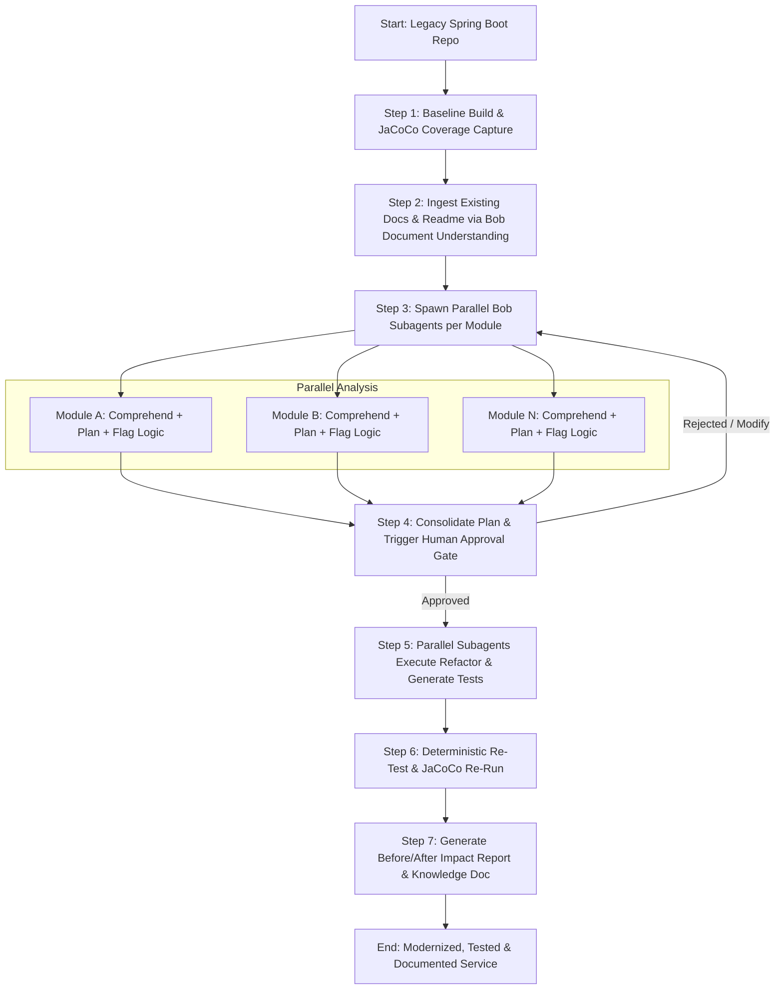

# Product Requirements Document (PRD) — SpringPhoenix

## 1. Overview
**SpringPhoenix** is an autonomous, subagent-driven modernization pipeline built on **IBM Bob 2.0** for enterprise engineering teams. It safely accelerates legacy Spring Boot migrations (e.g., Java 8/11 and Spring Boot 1.5.x/2.x to Java 17/21 and Spring Boot 3.x) by combining deterministic build/test verification, parallel subagent refactoring, automated unit test synthesis, undocumented business-logic extraction, and a mandatory human approval gate.

---

## 2. Problem Statement
Enterprise teams maintain thousands of legacy Spring Boot microservices and monoliths that accumulate two debilitating types of technical debt:
1. **Code & Dependency Debt:** Outdated frameworks, deprecated APIs (e.g., `javax.*` to `jakarta.*`, legacy Spring Security configurations), unpatched CVEs, and incompatible dependencies.
2. **Knowledge & Test Debt:** Low or near-zero test coverage and undocumented domain logic preserved only in the heads of past developers.

Upgrades are considered high-risk, slow, and costly because teams fear breaking implicit business rules with no test suite to catch regressions.

---

## 3. Target User & Personas
- **Primary Persona:** Enterprise Backend Engineers and Tech Leads tasked with upgrading legacy Java / Spring Boot applications across enterprise estates.
- **Secondary Persona:** Engineering Managers, Architects, and AppSec Teams requiring verified compliance, regression-free modernization, and documented business logic.

---

## 4. Goals & Non-Goals

### 4.1 Goals
- **Deterministic Baseline Guarantee:** Capture clean, reproducible build and test coverage baselines before modifying any source code.
- **Parallel Subagent Modernization:** Isolate and refactor multi-module or decoupled service packages concurrently using IBM Bob 2.0 subagents.
- **Automated Test Generation:** Synthesize robust JUnit 5 and Mockito test suites focused on business-critical and regression-prone paths.
- **Knowledge Preservation:** Automatically detect and extract undocumented business rules, edge cases, and architectural constraints into a living `knowledge-doc.md`.
- **Human-in-the-Loop Governance:** Enforce an explicit review checkpoint where engineers inspect refactor plans and flagged risks before code modifications are applied.
- **Verifiable Impact Reporting:** Generate a comprehensive before-and-after diff detailing coverage change (%), test pass rates, build duration, and migration logs.

### 4.2 Non-Goals
- **Zero-Human Architecture Overhauls:** Not intended to autonomously redesign relational schemas or rewrite monolithic architectures into distributed event streams without human specification.
- **Arbitrary Language Translation:** Focused exclusively on the JVM / Spring ecosystem (Java, Kotlin, Maven, Gradle).
- **Production Auto-Deployment:** Does not deploy to live production environments directly; outputs validated code branches, diffs, and pull-request artifacts.

---

## 5. Core Features & Requirements

### Feature 1: Baseline Build & Test Capture (Deterministic Layer)
- Executes local Maven/Gradle builds to establish source truth.
- Extracts current compilation status, test pass/fail counts, and JaCoCo code coverage metrics (line, branch, method).
- Persists baseline metrics as structured JSON (`baseline-report.json`).

### Feature 2: Document & Context Ingestion (Bob Document Understanding)
- Ingests repository documentation (READMEs, design docs, swagger/OpenAPI specs, changelogs).
- Provides semantic domain context to subagents to guide refactoring and test intent.

### Feature 3: Parallel Subagent-Driven Module Refactoring
- Spawns isolated IBM Bob subagents mapped to discrete modules or packages.
- Each subagent executes:
  - AST-informed dependency & plugin updates (e.g., Spring Boot 3 baseline).
  - Deprecated API migrations (e.g., `SecurityFilterChain` beans, `WebMvcConfigurer`, Jakarta EE namespace).
  - Identification and tagging of undocumented or fragile business logic.

### Feature 4: Automated Unit Test Synthesis
- Subagents generate standard JUnit 5, AssertJ, and Mockito tests for uncovered and refactored business classes.
- Ensures tests adhere to enterprise testing best practices (isolated mock boundaries, meaningful assertions, no flakiness).

### Feature 5: Undocumented Business-Logic Flagging & Knowledge Doc Generation
- Flags complex conditional trees, legacy workarounds, and non-standard domain heuristics.
- Aggregates findings into a standardized `docs/knowledge-doc.md` explaining *what* the code does, *why* it exists, and associated migration risks.

### Feature 6: Human Approval Gate
- Halts pipeline execution before committing changes to disk/branch.
- Presents an interactive summary of proposed file diffs, flagged logic risks, and newly generated test suites for explicit user sign-off (`Approve` / `Reject` / `Adjust`).

### Feature 7: Before/After Verification & Impact Report
- Re-executes the build and test suite deterministically on the modernized codebase.
- Produces an automated Markdown and HTML impact report comparing:
  - Code Coverage (% line & branch change)
  - Test suite count and pass rate (e.g., `0 tests -> 48 tests passing`)
  - Build status and total execution time
  - Summary of resolved deprecations and discovered domain rules.

---

## 6. User Flow

---

## 7. Success Metrics & Key Results (OKRs)

| Metric | Baseline Target | Success Threshold |
|---|---|---|
| **Build Success Rate** | Legacy baseline state | 100% clean Maven/Gradle compilation on modern target |
| **Test Coverage Increase** | < 20% average | $\ge$ 70% line coverage on modernized modules |
| **Zero Regression** | N/A | 100% baseline test compatibility maintained |
| **Knowledge Capture** | 0 documented hidden rules | 100% of flagged complex heuristics cataloged in `knowledge-doc.md` |
| **Time-to-Modernize** | Days/Weeks of manual triage | < 15 minutes automated pipeline run |

---

## 8. Out-of-Scope Items
- Live database schema migration execution (e.g., executing Flyway/Liquibase DDL scripts against production DBs).
- Rewriting frontend client assets (JSP/Thymeleaf to React/Angular).
- Automated cloud infrastructure provisioning (Terraform / Kubernetes manifests).
